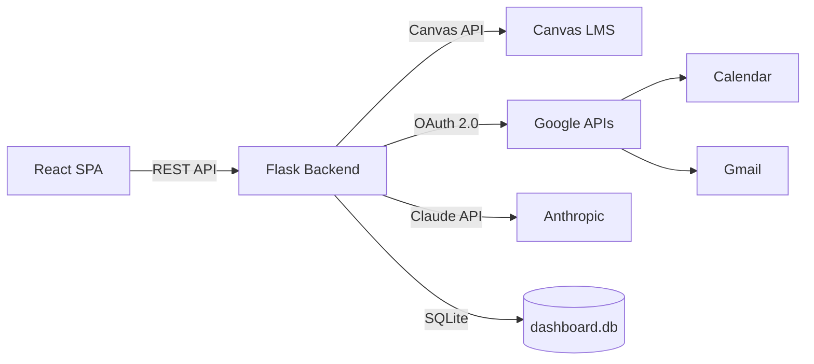

# Canvas Executive Dashboard

A personal dashboard for MIT EMBA students to track Canvas assignments, sync to Google Calendar, and extract tasks from email announcements.

## Architecture



The React frontend communicates with the Flask backend over a REST API. The backend integrates with Canvas LMS for assignment data, Google APIs (Calendar and Gmail) via OAuth 2.0, and Anthropic's Claude API for AI-powered task extraction and next-action suggestions. All persistent state is stored in a local SQLite database.

## One-Click Deploy (Render)

[](https://render.com/deploy?repo=https://github.com/imranamindar-rgb/canvas-dashboard)

1. Click the button above
2. Fill in your **Canvas API Token** (get from canvas.mit.edu → Account → Settings → New Access Token)
3. Fill in your **Anthropic API Key** (get from console.anthropic.com)
4. Click **Create Web Service**
5. Wait ~2 minutes for the build
6. Open your dashboard URL

> Google Calendar sync and Email task extraction require additional setup (Google OAuth credentials). The dashboard works great without them — Canvas assignments are the core feature.

## Docker (Local)

### Prerequisites

- [Docker Desktop](https://www.docker.com/products/docker-desktop/)
- Python 3 (for one-time Google OAuth setup only)

### Setup

```bash
git clone <repo-url>
cd canvas-dashboard
./setup.sh          # Creates .env, authorizes Google, starts containers
```

### Commands

```bash
docker compose up -d          # Start
docker compose down            # Stop
docker compose logs -f         # View logs
docker compose up --build -d   # Rebuild after code changes
```

## Local Development

```bash
# Backend
cd backend && python3 -m venv .venv && source .venv/bin/activate
pip install -r requirements.txt
cp .env.example .env  # Edit with your tokens
python app.py

# Frontend (separate terminal)
cd frontend && npm install && npm run dev

# Open http://localhost:5173
```
